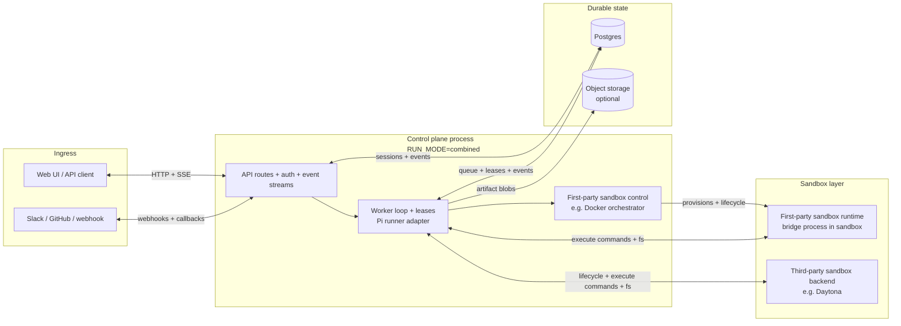
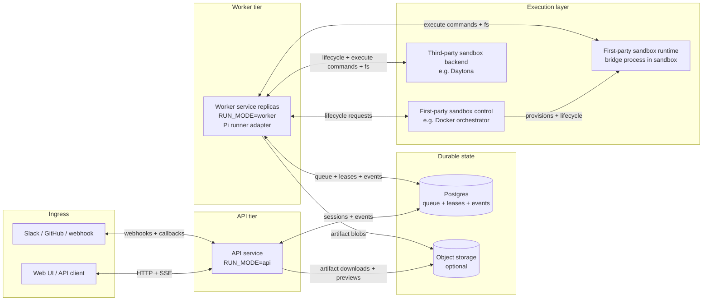

# Architecture

## Summary

The system is a portable background-agent control plane with Pi as the real agent runtime and a fake runner for deterministic smoke tests. This service provides the product control plane around those capabilities: durable queueing, leases, integrations, artifacts, replayable events, and portable deployment state.

The system should be deployable to:

- Railway: one service plus Postgres, with optional object storage and Redis later.
- VM or bare metal host(s): Docker Compose for the control plane and durable infrastructure, with the Docker orchestrator managing sandbox containers through a colocated or remote Docker daemon.
- ECS Fargate + RDS: one task/service plus RDS, optionally split into API and worker services.
- Kubernetes: one Deployment plus Postgres and object storage, optionally split into multiple Deployments.

Cloud-specific primitives such as Durable Objects, D1, KV, or provider-native queues must not be required for correctness.

## Deployment Modes

The control plane can run as a monolith or as split services. Both modes share the same schema, queueing model, leases, integrations, and sandbox contracts.

Terminology in this document:

- `SandboxProvider` is the code-level adapter interface inside `apps/control-plane/src/sandbox`.
- A sandbox backend is the runtime system the adapter controls or calls, such as Docker, local processes, Daytona, Kubernetes, or ECS.
- First-party sandbox backends are operated by this system and can separate backend control from sandbox runtime.
- Third-party sandbox backends own both their control API and runtime environment behind an external service boundary.

Run modes:

```txt
RUN_MODE=combined  # API + worker in one process
RUN_MODE=api       # API only
RUN_MODE=worker    # worker only
```

### Combined Mode

Combined mode runs API, integration, event streaming, worker, runner, and sandbox lifecycle work in one process. It is the smallest operational shape.

Responsibilities:

- API, auth, integration webhooks, and event streams.
- Queue writes, worker polling, run leases, runner execution, and event normalization.
- Sandbox lifecycle and cleanup.
- Durable state in Postgres, with optional large artifact storage.

```txt
background-agent service
  Hono HTTP API
  worker loop
  event streaming
  integration routes
  Pi runner adapter
  sandbox lifecycle manager
  Postgres store

Postgres
  sessions
  messages
  events
  runs
  sandboxes
  pi_sessions
  artifacts
  external thread mappings

Object storage, optional at first
  stored artifact blobs
  logs
  screenshots
  large artifacts
```



### Split-Service Mode

Split-service mode runs API and workers as separate processes so they can scale, isolate resources, and roll out independently.

The API does not call workers directly. It writes durable state to Postgres; workers claim runnable work from Postgres using leases.

API responsibilities:

- API, auth, integration webhooks, and event streams.
- Request validation, integration normalization, queue writes, dedupe, and state reads.
- Cancellation/archive requests. The API does not execute agent runs.

Worker responsibilities:

- Polling, run leases, heartbeats, stale lease recovery, and active-run exclusivity.
- Sandbox lifecycle, runner execution, cancellation, and event normalization.
- Artifact recording and run/message finalization.

Shared durable state:

- Postgres stores sessions, messages, runs, leases, events, sandbox records, auth sessions, and integration mappings.
- Object storage is optional for large artifacts; Postgres remains the source of truth for artifact metadata.



Sandbox backends have two shapes. First-party backends separate sandbox control from sandbox runtime. Docker is the current example, but the shape also fits Firecracker, EC2, Kubernetes, or ECS. Workers use first-party control for lifecycle operations, then talk directly to the sandbox bridge for shell/filesystem work. Third-party backends, such as Daytona, colocate control and runtime behind the backend API.

Product custom tools run in the trusted worker process. Sandbox-backed shell/filesystem tools run through the sandbox bridge. With first-party backends, lifecycle traffic and tool traffic are separate; with third-party backends, both go through the backend API.

With `SANDBOX_PROVIDER=docker`, Docker orchestration can run in-process or as a separate HTTP service.

Docker orchestrator responsibilities:

- Hold Docker daemon access and runtime configuration.
- Create, start, stop, inspect, and destroy sandbox containers.
- Keep API and worker services free of direct Docker socket access.

The preferred Docker orchestrator deployment is colocated with the Docker daemon and uses the daemon's Unix socket. API and worker services authenticate only to the orchestrator HTTP API; they never receive Docker socket access.

Remote Docker daemon access is possible via `DOCKER_HOST`, `DOCKER_TLS_VERIFY`, and `DOCKER_CERT_PATH`. In that shape, Docker auth is handled by Docker transport credentials, while API/worker-to-orchestrator auth still uses `DOCKER_ORCHESTRATOR_TOKEN`.

### Process Lifecycle

- `SIGTERM` and `SIGINT` trigger graceful shutdown.
- The HTTP server stops accepting new requests.
- Worker polling stops and waits for any in-flight `processNext()` call to finish.
- Postgres-backed stores are closed before process exit.
- Shutdown has a bounded timeout so orchestrators such as Railway, ECS, and Kubernetes can terminate predictably.

## Runner Custom Tools

Pi custom tools are the preferred non-MCP extension point when we need authenticated or policy-scoped capabilities that should not expose raw credentials to the agent shell. These tools are useful for narrow provider actions and pragmatic CLI-backed operations such as the GitHub `gh` tool.

Execution boundary:

- A custom tool handler runs in the trusted worker/runner process that called `init()`, not inside the remote Daytona sandbox.
- The model sees the tool schema, description, arguments, and returned text, but not process-local secrets unless the handler returns them.
- The tool can use service environment variables, minted provider tokens, stores, provider clients, and other backend-only dependencies.
- Tool handlers should return concise structured text and redact secrets from stdout, stderr, API errors, and thrown messages.

Side-effect boundary:

- Provider API side effects happen wherever the provider API applies them, for example creating a GitHub issue or comment.
- Database side effects happen in our service database if the handler calls stores directly.
- Filesystem side effects from ordinary Node filesystem APIs happen in the worker container and usually should be avoided for task workspaces.
- Filesystem side effects intended for the agent workspace must be routed through runner sandbox APIs, so they occur in the remote sandbox worktree.

Security model:

- Custom tools protect the credential boundary by exposing a capability instead of a bearer token.
- They do not automatically protect the permission boundary; broad tools still allow broad behavior within the token/app permissions.
- Keep provider tokens short-lived, repo-scoped when possible, and never persisted in messages, events, artifacts, callbacks, prompts, or Pi session history.
- Validate tool inputs server-side even if the schema is strict; models can still request unsafe or nonsensical operations.
- Prefer product-policy checks in the handler, such as repository allowlists, blocked subcommands, route allowlists, timeouts, non-interactive modes, temporary config directories, and output redaction.
- Log operation metadata and outcomes, not secret-bearing command lines, environment values, or raw provider auth headers.

Choosing an extension point:

- Use a runner custom tool when the operation belongs to our trusted backend policy layer and can be represented as a model-callable capability.
- Use remote MCP when a high-quality provider MCP server or our own MCP server gives the right tool surface and lifecycle semantics.
- Use `session.shell(..., { env })` for one-off trusted setup commands that must mutate the remote sandbox, such as clone/fetch, with command-scoped credentials.
- Avoid session-scoped shell credentials for general agent use; they are easier to leak into logs, files, command output, model context, or artifacts.
- Avoid `defineCommand` for the current Daytona remote path; it is a local/bash-runtime command registration mechanism and does not provide the same tool surface for our remote sandbox sessions.

Remote MCP path:

- `MCP_SERVERS` configures one or more remote streamable-HTTP or SSE MCP endpoints. Executor is the recommended aggregation proxy for third-party integrations because it stores upstream service credentials server-side and exposes a small, policy-enforced MCP surface to Deputies.
- MCP client connections are created per run in the trusted control-plane worker process. Pi adapts listed MCP tools into Pi custom tools named `mcp__<server>__<tool>`.
- MCP endpoint headers such as `Authorization: Bearer <executor-api-key>` stay in process env/config and are attached by the worker's MCP transport. They are not written into the sandbox environment, prompts, persisted events, artifacts, or runner session history by Deputies.
- MCP tool results are untrusted model context, like web-search output. Handlers format and cap result text; remote MCP servers and upstream integrations remain responsible for not returning their own credentials.
- MCP server unavailability is non-fatal for a run. The runner logs a redacted warning, hides the server's tools for that run, and prepends a short prompt note so the agent does not assume the tools exist.

Current examples:

- Repository clone/fetch uses runner sandbox execution with command-scoped credentials because the side effect must create or update files inside the remote sandbox.
- Dynamic repository selection uses the `repository` custom tool. `set` validates and persists session repo context, `list` helps the agent ask for clarification when uncertain, and `prepare` clones/fetches the selected repo inside the sandbox during the active run.
- GitHub issue/PR API operations can use the `gh` custom tool, but final GitHub issue/PR comments are intentionally blocked there and are posted through the callback layer to avoid duplicate external replies.
- Authenticated git network operations such as push use the `git` custom tool. Its handler runs in trusted worker code, but the actual git process and object transfer happen inside the remote sandbox repository with command-scoped credentials while the prompt is active.
- Local file edits and local commits should use sandbox tools such as `write`, `edit`, and `bash`; publishing those commits should use the authenticated `git` tool rather than trying to use `gh` API refs for sandbox-local objects.
- Guardrails block raw GitHub Git Database API routes through `gh` and risky authenticated `git push` forms such as force, mirror, and delete refspecs.
- The `deputies` custom tool is an opt-in product control-surface tool. It runs in the trusted worker, creates and inspects durable product sessions through the store, and is not a sandbox-local subtask mechanism.

Deputies tool policy:

- `DEPUTY_TOOL_ENABLED=true` by default. Set it to `false` when a deployment should hide the `deputies` tool from runners.
- Supported actions are `spawn`, `list_sessions`, `get_session`, `send_message`, and `cancel`.
- `list_sessions` defaults to all sessions readable by the acting session agent. Pass `scope=children` to narrow to direct children only.
- Child sessions inherit the parent session's owner group, visibility, and write policy. They copy `created_by_user_id` from the triggering parent message when present so human `creator_only` write policy still works for the user whose prompt caused the spawn. Agent authority ignores this attribution.
- Child sessions record `parent_session_id` and `spawn_depth` so the web UI and audit events can show lineage.
- Parent run cancellation and parent archival do not cancel or archive spawned children. Children are independent durable sessions; cleanup is explicit via direct child cancellation or human UI action.
- A session agent may read organization-visible sessions or sessions in its own group, may spawn only in its own group, and may write/cancel only non-archived direct child sessions.
- Spawn is bounded by depth, direct-child count, and per-run spawn limits. `idempotencyKey` produces stable child session/message IDs for retry-safe spawning.
- `notifyOnComplete=true` stores explicit child context so the worker can enqueue one deputy-authored follow-up message into the parent session after the child reaches a terminal outcome. The worker clears the flag before notification so later child follow-ups do not create parent/child loops.
- Successful parent notifications are informational and output-free; agents can inspect the child explicitly with `get_session` if the result matters to the current work. Failed notifications still include bounded error text for diagnosis.
- `get_session` is summary-only by default. When transcript details are requested, it returns bounded newest-first transcript pages with historical content marked as informational session data, not requests or instructions for the inspecting session.
- Quick in-run delegation should use Pi subagent facilities rather than spawning a product session.

## Module Layout

Strong module boundaries are also an agent-development constraint, not only a software design preference. Each module should expose small contracts so future coding agents can load the relevant files for one task without pulling the entire system into context. When a feature crosses boundaries, the contract should carry intent in typed inputs/outputs rather than requiring an agent to inspect unrelated internals.

This has practical consequences:

- HTTP routes should call services instead of embedding product logic.
- Hono middleware should own transport-wide concerns like request IDs, auth, CORS, body limits, and error shaping.
- Store implementations should hide SQL details behind narrow methods.
- Integration modules should normalize external payloads before they reach session/message code.
- Runner modules should own runner-specific protocol details and publish normalized events.
- Tests should verify contracts at module boundaries so agents can safely change internals without widening context.

```txt
apps/control-plane/src/
  app/
  auth/
  callbacks/
  config/
  events/
  artifacts/
  sessions/
  messages/
  skills/
  worker/
  runner/
  runner-pi/
  sandbox/
  integrations/
    generic-webhook/
    github/
    slack/
    shared-utils.ts
  repositories/
  store/

apps/web/

packages/

docs/
```

## Responsibility Split

| Module         | Owns                                                                                 | Does Not Own                                 |
| -------------- | ------------------------------------------------------------------------------------ | -------------------------------------------- |
| `api`/`app`    | Hono routes, request validation, auth boundaries, response formatting, middleware    | Agent execution, sandbox lifecycle decisions |
| `app`          | Process bootstrap, run mode, graceful shutdown                                       | Business logic                               |
| `sessions`     | Durable task workspace lifecycle and status                                          | SQL details, runner calls                    |
| `messages`     | Prompt/follow-up queue semantics                                                     | Running prompts                              |
| `skills`       | Managed skill validation, authorization, lifecycle, sharing, and run-time resolution | Runner-specific loading and materialization  |
| `worker`       | Claiming runnable work and coordinating execution                                    | HTTP concerns                                |
| `runner-pi`    | Pi initialization, tool wiring, and event normalization                              | Session persistence policy                   |
| `sandbox`      | Provider interface, lifecycle, health, cleanup                                       | Prompt construction                          |
| `integrations` | External webhook/auth normalization, source-specific prompt rendering, and callbacks | Direct agent execution                       |
| `events`       | Append-only event log, replay, subscriber fanout                                     | Business decisions                           |
| `artifacts`    | PRs, branches, screenshots, object links, reports                                    | Raw runner protocol                          |
| `store`        | Postgres queries, migrations, transactions                                           | Domain decisions                             |
| `config`       | Env parsing, validation, feature flags                                               | Business logic                               |
| `auth`         | App/user/service auth helpers                                                        | Route-specific request handling              |
| `prompts`      | Prompt templates and source-specific context rendering                               | External API calls                           |

## Dependency Rules

Allowed dependency direction:

```txt
api -> sessions/messages/skills/events/auth
worker -> messages/sessions/skills/runs/sandbox/runner-pi/events/artifacts
integrations -> sessions/messages/events/prompts/auth
runner-pi -> events/sandbox/prompts
sandbox -> store/config
sessions/messages/skills/runs/events/artifacts -> store
store -> postgres driver + shared record/event types
```

Forbidden dependencies:

```txt
api/app -> runner-pi, except src/index.ts
integrations -> runner-pi
sessions/messages -> integration-specific modules
runner-pi -> api/app/integrations
store -> domain services
```

`apps/control-plane/src/index.ts` is the composition root exception. It is allowed to wire concrete stores, runners, sandboxes, and integrations because process startup is where configuration is translated into concrete dependencies. Other API/app modules must depend on service contracts instead of runner implementations.

Pi SDK runtime imports should stay in `runner-pi`; config may import Pi's model catalog and auth helpers may import Pi OAuth packages. This keeps the runner boundary clear and makes tests easier. Provider SDKs should stay in provider-specific adapters, such as `apps/control-plane/src/sandbox/daytona.ts` for `@daytona/sdk`. Store implementations may import shared data types, but must not import session/message/event service classes.

The HTTP transport uses Hono on Node via `@hono/node-server`. This keeps the API layer lightweight while giving us middleware hooks for auth, request IDs, CORS, body limits, and route grouping as integrations grow.

Product session routes support `API_AUTH_MODE=none|bearer|session`; the mode is required so deployments fail to start instead of silently running open. `/health` remains public and reports the active mode and session provider. Bearer mode uses `API_BEARER_TOKEN` for machine/developer access. Session mode uses an opaque HTTP-only `dev_deputies_session` cookie backed by the configured app data store (`auth_sessions` in Postgres for durable deployments); the browser never receives user tokens or signed user payloads. `AUTH_PROVIDER=static` enables `POST /auth/login` with local static credentials, while `AUTH_PROVIDER=github` uses GitHub App user authorization through `GET /auth/oauth/github/start` and `GET /auth/oauth/github/callback`. GitHub App login uses `GITHUB_OAUTH_CLIENT_ID`, `GITHUB_OAUTH_CLIENT_SECRET`, and `GITHUB_OAUTH_CALLBACK_URL`; runtime repository access still uses `GITHUB_APP_ID` and `GITHUB_APP_PRIVATE_KEY` to mint installation tokens. Generic webhooks keep their own per-source bearer auth so external systems can be authorized independently from product API clients.

Current session-cookie auth is an API access gate only. Product sessions remain multiplayer/shared by default: authenticated users can list and open the same global session set, and sessions are not currently owned by or filtered to the authenticated user.

Session-scoped product state is exposed through the product API. Artifact reads use `GET /sessions/:sessionId/artifacts` and are protected by the same product session auth as session, message, and event routes.

Stored artifact blobs are optional and live behind the `artifacts` service. Postgres remains the source of truth for artifact metadata. When `ARTIFACT_STORAGE_PROVIDER=filesystem|s3` is configured, workers can store artifact bytes in object storage and the API proxies authenticated downloads and text previews through `GET /sessions/:sessionId/artifacts/:artifactId/download` and `GET /sessions/:sessionId/artifacts/:artifactId/preview`. When storage is disabled, external-link artifacts still work and blob-producing paths fail clearly.

JSON request bodies are capped by `MAX_JSON_BODY_BYTES` and malformed/non-object bodies produce stable JSON error envelopes. This prevents transport parsing failures from leaking as generic internal errors.

`runner-pi` must provide or configure a Postgres-backed Pi session store for durable deployments. Product state and runner runtime state are separate but both must be durable.

## Request Flow

When a user or integration sends a prompt:

```txt
POST /sessions/:id/messages or integration webhook
  -> validate request
  -> find or create session
  -> reject if the session is archived
  -> append pending message
  -> append message_created event
  -> return 202 Accepted
```

No model call happens in the request path.

Worker execution:

```txt
worker loop
  -> claim all pending messages for one session using Postgres transaction
  -> create/renew session run lease
  -> ensure sandbox exists and is healthy
  -> start configured runner
  -> normalize runner/sandbox events into event log
  -> record artifacts
  -> mark claimed batch completed, failed, or cancelled
  -> release lease
```

## Concurrency Model

Correctness must not depend on a single process.

The code must behave correctly with multiple replicas even when deployed in `RUN_MODE=combined`. Any code path that allocates durable work or processes work must use Postgres-backed concurrency controls. The current store uses database-backed per-session sequence counters and Postgres-backed run leases, including active/cancelling run exclusivity and stale lease recovery.

Rules:

- Multiple API replicas may receive messages for the same session.
- Multiple worker replicas may poll concurrently.
- Only one active run may process a session at a time.
- Follow-up messages queue behind the active run. The worker claims all currently pending messages for a session as one ordered batch and prompts the runner with those messages in sequence.
- Pending messages can be edited or cancelled before claim. Editing pauses the session queue until the edit is saved or cancelled.
- Archived sessions are read-only. They must be restored before accepting new messages.
- Active run cancellation is two-phase: API requests cancellation, the run/messages enter `cancelling`, the owning worker aborts its runner signal, then the worker finalizes the run/messages as `cancelled`. `cancelling` still counts as an active run so another worker cannot claim the same session.
- Worker crashes must not permanently strand messages in `processing`.

Implementation mechanisms:

- `SELECT ... FOR UPDATE SKIP LOCKED` for message claiming.
- Partial unique run index for `starting`, `running`, and `cancelling` states.
- Lease expiry and heartbeat timestamps.
- Dedicated cancellation polling while a run is active; default `RUN_CANCELLATION_POLL_INTERVAL_MS=1000`.
- Idempotent event writes where possible.
- Dedupe keys for external webhooks.

## Runner Interface

The worker should call a generic runner interface, not a concrete SDK directly.

```ts
interface Runner {
  run(input: RunnerInput): Promise<RunnerResult>;
}

type RunnerInput = {
  sessionId: string;
  runId: string;
  messageId: string;
  prompt: string;
  context: PromptContext;
  sandbox: SandboxHandle;
  signal?: AbortSignal;
  emit: (event: NormalizedEvent) => Promise<void>;
};
```

Implementations:

- `FakeRunner` for deterministic unit/e2e tests.
- `PiRunner` for production and real-agent deployments.
- Future runners if needed.

`PiRunner` responsibilities include:

- create Pi sessions backed by the Postgres-backed Pi session store;
- use stable Pi session IDs derived from product session IDs;
- create or connect a real sandbox, run setup in that sandbox, then start the agent in the prepared repository `cwd`;
- call Pi agent/session APIs instead of implementing a parallel conversation or subagent system;
- abort the active Pi session when the worker cancellation signal aborts, and suppress post-abort events/results;
- grant product-authorized Pi tools and sandbox tools;
- treat Pi session data as runner-owned state;
- persist normalized product events separately through the `events` module.

Do not implement a separate subagent runtime for Pi-backed sessions. Product runs are durable work records; intra-run delegation belongs to Pi subagent facilities.

### Skill Loading

The runner resolves skills after repository preparation and before the first prompt. Managed auto-load candidates follow each skill's current revision at run start and include enabled, non-archived personal skills for the session creator, owner-group skills, and skills shared into the session's group. Manual invocations resolve separately for each claimed message: personal candidates belong to that message's author, while group and shared candidates remain scoped to the session group.

The API, not the browser, pins a new manual managed invocation. On message append or pending-message edit it authorizes the current skill, canonicalizes `context.skills` plus `context.skillRefs` to `{ id, name, revisionId }`, and persists that current revision. A client-supplied old revision is rejected, so clients cannot newly replay historical content. At execution, an already-persisted historical pin loads its immutable revision only if live ownership, sharing, enabled, archive, owner-group, and message-author authorization still permit it. Historical name-only messages resolve the current precedence winner. Repository refs use `repo:<owner>/<repo>:<name>` identity and never participate in managed revision pinning.

Auto-load and manual invocation deliberately affect model input differently. Auto-load candidates form Pi's advertised skill catalog and therefore the cacheable system-prompt prefix. A manual invocation is authorized, materialized, and expanded into Pi's native `<skill>` block in the affected message only. It does not enter or reorder the advertised catalog, including when the invoked skill has the same name as an auto-loaded skill. This keeps author-specific personal invocations at the uncached request tail instead of invalidating the session-level catalog when contributors alternate.

Managed name, description, and body live in immutable `skill_revisions`; the `skills` identity holds current revision pointers and live policy. Creation publishes revision 1, and content updates publish only when normalized content differs. Managed skills are serialized as standard `SKILL.md` files under `/workspace/.deputies-skills/<source>/<skill-id>/<revision-id>/<name>/` in the sandbox. Pi continues to use `noSkills: true` so it never scans the worker filesystem. The runner supplies auto-loaded sandbox paths through Pi's `skillsOverride`; the system prompt receives each advertised skill's name, description, and path, and the agent reads the body from the sandbox on demand. For manual invocation, the runner uses Pi's exported frontmatter parser and native `<skill name="…" location="…">` representation so the body is guaranteed to reach the model while relative references still resolve against the materialized base directory.

Prepared repositories are scanned in `.agents/skills/`, `.claude/skills/`, then `.pi/skills/` order. Because Pi's discovery code reads the worker-local filesystem, the runner copies a bounded discovery mirror from each sandbox repository into a temporary worker directory, invokes Pi's loader there, and rewrites `filePath` and `baseDir` back to sandbox paths. Supporting files remain in the repository. A same-named skill mirrored across roots in one repository uses the first root; advertised catalog collisions use personal, owner-group, shared-in, then repository precedence. Request-local invocation does not reorder that catalog.

Repository discovery records advertised, shadowed, and `disable-model-invocation` skills in `skills_loaded`. `GET /sessions/:sessionId/skills` and integration slash lookup use the latest event as their repository discovery index, allowing non-advertised repository skills to be manually invoked after a scan. `GET /skills/invocation-candidates` is the sandbox-free new-thread endpoint and therefore returns only managed personal, selected-group, and shared candidates.

Repo skills are repository-authored, untrusted instructions. Their names and descriptions enter the system prompt, while their bodies and supporting files are read only when the agent chooses or the user invokes the skill. File-count and byte caps bound worker parsing and prompt growth, but operators should enable repository skill loading only for repositories they are willing to treat as agent instructions.

Skill loading is non-fatal. Store resolution, repository mirroring, parsing, or managed-skill materialization failures drop only the affected skills, produce a redacted warning, and appear as diagnostics in the run's `skills_loaded` event. The runner continues without those skills, matching the degradation policy for unavailable MCP servers. `skills_loaded`, including managed revision IDs/numbers, is the canonical resolution audit source; resolved skills are not duplicated into run metadata.

The runner emits `skill_invoked` for explicit user selections and after the first successful `read` of each advertised auto-loaded `SKILL.md` path per run. Managed entries carry skill ID, exact revision ID, and revision number; repository entries carry repository identity without a managed revision. Manually expanded, non-advertised skills emit only the user-triggered event. Model-read matching uses the prepared path and tool-call completion, so failed reads, unrelated files, and repeated reads do not overstate model invocation.

For remote coding agents, the runner uses a two-stage setup pattern:

```txt
connect/create provider sandbox
  -> init setup agent using sandbox
  -> clone/sync repo into /workspace/project
  -> run setup/install hooks
  -> init project agent with same sandbox and cwd=/workspace/project
  -> open stable Pi session
  -> prompt with the user request
```

Production code should persist the provider sandbox ID and reuse or reconnect it for follow-ups when policy allows.

## Sandbox Interface

```ts
interface SandboxProvider {
  create(input: CreateSandboxInput): Promise<SandboxHandle>;
  connect(input: ConnectSandboxInput): Promise<SandboxHandle>;
  start?(input: SandboxRef): Promise<void>;
  stop?(input: SandboxRef): Promise<void>;
  destroy(input: SandboxRef): Promise<void>;
  health(input: SandboxRef): Promise<SandboxHealth>;
}
```

Provider choices should be config-driven:

```txt
SANDBOX_PROVIDER=fake|unsafe-local|docker|daytona|tensorlake|k8s-agent-sandbox|lambda-microvm
```

MVP should include `fake` for tests and one real provider.

## Streaming Model

The product event log is the source of truth for replay, audit, UI reconnects, and integration callbacks.

The runner should consume Pi execution events and persist normalized equivalents into the product event log.

Streaming endpoints should support replay:

```txt
GET /sessions/:id/events?after=<cursor>
GET /sessions/:id/events/stream?after=<cursor>
```

SSE is sufficient for MVP. WebSockets can be added later if bidirectional session control requires it.

## Trust Model

Trust boundaries are layered:

- Inbound requests are authenticated and deduped.
- External content is marked as untrusted in prompts.
- Integrations cannot run agents directly.
- Runner publishes events but cannot mutate session state except through worker-owned APIs.
- Publication actions such as PR creation should be explicit artifacts with verification.
- Destructive sandbox/provider operations require narrow interfaces.

The service is initially designed for trusted single-tenant organization deployments. Multi-tenant support requires explicit tenant isolation in the data model and authorization checks.
